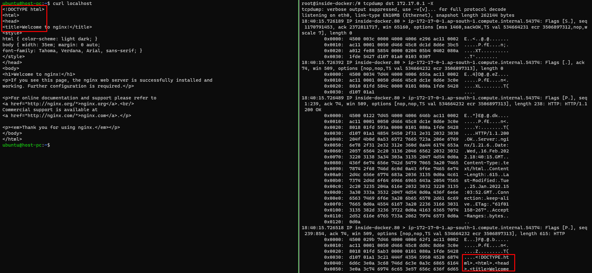
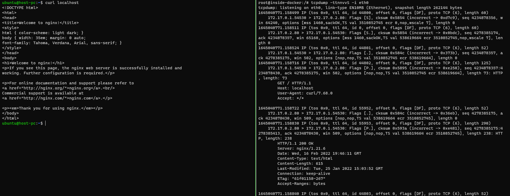

# Setup
#### Install docker with
```
sudo apt-get update

sudo apt-get install ca-certificates curl gnupg lsb-release

curl -fsSL https://download.docker.com/linux/ubuntu/gpg | sudo gpg --dearmor -o /usr/share/keyrings/docker-archive-keyring.gpg

echo \
  "deb [arch=$(dpkg --print-architecture) signed-by=/usr/share/keyrings/docker-archive-keyring.gpg] https://download.docker.com/linux/ubuntu \
  $(lsb_release -cs) stable" | sudo tee /etc/apt/sources.list.d/docker.list > /dev/null

sudo apt-get update

sudo apt-get install docker-ce docker-ce-cli containerd.io -y
```

#### Run a nginx container with
`sudo docker run -d -p 80:80 --hostname inside-docker --name nginx nginx`

#### Open shell inside that docker container with 
`sudo docker exec -it nginx bash`

#### Install TCPDUMP inside the container
`apt-get update`
`apt-get upgrade -y`
`apt-get install tcpdump -y`

#### *We will communicate from the host to this container to test out our commands.


## 1. Draw the IP Header with detailed bits.


## 2. What is TCPDUMP?

Solution: TCPDUMP is a tool for analyzing network.

## 3. How to get the HTTPS traffic? 
`tcpdump -nnSX port 443`

from container: `tcpdump -nnSX port 443`

from host : `curl https://www.minhazul.com`

## 4. For everything on an interface, what is the command?
`tcpdump -i <interface name>`

FC: `tcpdump -i eth0`

FH: `curl localhost`


## 5. Write the command to find traffic by IP.
`tcpdump host <ip address>`

FC: `tcpdump host 172.17.0.1`

FH: `curl localhost`


## 6. Share the filtering by source and destination?

`tcpdump src <ip address>`

`tcpdump dst <ip address>`

FC: `tcpdump src 172.17.0.1`

FH: `curl localhost`


FC: `tcpdump dst 172.17.0.1`

FH: `curl localhost`


## 7. How to find packets by network?
`tcpdump net <network range>`

FC: `tcpdump net 172.17.0.0/24`

FH: `curl localhost`


## 8. How to see packet contents with hex output?
Solution: add `-X` flag

FC: `tcpdump dst 172.17.0.1 -X`

FH: `curl localhost`



## 9. How to find a specific port traffic, write the command

`tcpdump port <port number>` 

`tcpdump src port <port number>`

`tcpdump dst port <port number>`

FC: `tcpdump port 80`

FH: `curl localhost`


## 10. Show traffic of one protocol command.

`tcpdump <protocol>`

FC: `tcpdump icmp`

FH: `ping 172.17.0.2`


## 11. Write the command showing only IP6 traffic.

`tcpdump ip6`

## 12. Write the command for finding traffic using port range.
`tcpdump portrange <port range>`

FC: `tcpdump portrange 70-440`

FH: `curl localhost:80`


## 13. What are PCAP (PEE-cap) files?

PCAP or PEE-cap files are files that contains captured packets. These files can be used by many network analysis tools.

## 14. How are PCAP files processed and why is it so?

The PCAP files are processed by many softwares. They are stored captured packets in binary format.

## 15. Which switch is used to write the PCAP file called capture_file?
the `-w` switch

`tcpdump -w <filename>`

## 16. What is the command for reading/writing capture to a file?

Writing: `tcpdump -w <filename>`

Reading: `tcpdump -r <filename>`

FC: `tcpdump -w capture_file`

FH: `curl localhost`


## 17. Which switch is needed to read the PCAP files?
The `-r` switch
## 18. What is the tcpdump command while reading in a file?

Writing: `tcpdump -r <filename>`

FC: `tcpdump -r capture_file`

FH: `curl localhost`


## 19. Which switch is used for the ethernet header?

The `-XX` flag

## 20. What is line-readable output? How is it notified?

The line readable output is used to view as the packets are being saved or to send output to other command through piping

## 21. What does `-q` imply?
It it used to make the output less informative.

FC: `tcpdump -q -i eth0`

FH: `curl localhost`


## 22. What does the tweak `-t` work?

Gives human readable timestamps.

## 23. What does `-tttt` show?

It gives the maximum human readable timestamp output

FC: `tcpdump -q -tttt -i eth0`

FH: `curl localhost`


## 24. To listen on the eth0 interface which one is used?

The `-i eth0` flag

## 25. Purpose for `-vv`?

It is used for maximum verbose output.

## 26. Purpose for `-c`?
By providing a number after it, we can limit the captured packets.

FC: `tcpdump -q -tttt -i eth0 -c 1`

FH: `curl localhost`


## 27. Why `-s` is used?
It is used to define the snaplength.
The `-s0` is used to get everything
## 28. What does -S, -e, -E imply?
The `-S` is used to print absolute sequence number.

The `-e` is used to print the ethernet header.

The `-E` is used to decrypt IPSEC traffic by providing encryption key.

## 29. How to show the raw output view?

`tcpdump -ttnnvvS`

FC: `tcpdump -ttnnvvS -i eth0`

FH: `curl localhost`



## 30. If a specific IP and destined course are given then which tweak is used?
The `and` or `&&` should be used

FC: `tcpdump src 172.17.0.1 and dst 172.17.0.2`

FH: `curl localhost`


## 31. To pass from one network to another, write the command?

## 32. If a non ICMP traffic goes to a specific IP, what should be the query?

## 33. If a host isn't on a specific port, what will be tweaked and commanded?

## 34. Why single quotes are used?

## 35. How to isolate TCP RST flags?

## 36. To isolate TCP SYN flags, which query is used?

## 37. To isolate packets that have both the SYN and ACK flags set, what should be the command?

## 38. How to isolate TCP URG flags?

## 39. How to isolate TCP ACK flags?

## 40. How to isolate TCP PSH flags?

## 41. How to isolate TCP FIN flags?

## 42. How is GREP used with TCPDUMP?

## 43. Command for both SYN and RST flags?

## 44. What to do for cleartext GET requests?

## 45. What to do to find HTTP host headers?

## 46. How to find HTTP cookies?

## 47. The command line for find SSH connections?

## 48. How to find DNS traffic?

## 49. Command for finding FTP traffic?

## 50. Find NTP traffic, what is the command?

## 51. Command to find cleartext passwords?

## 52. Describe EVIL bit.

## 53. Write the fun filter to find packets where it's been toggled?