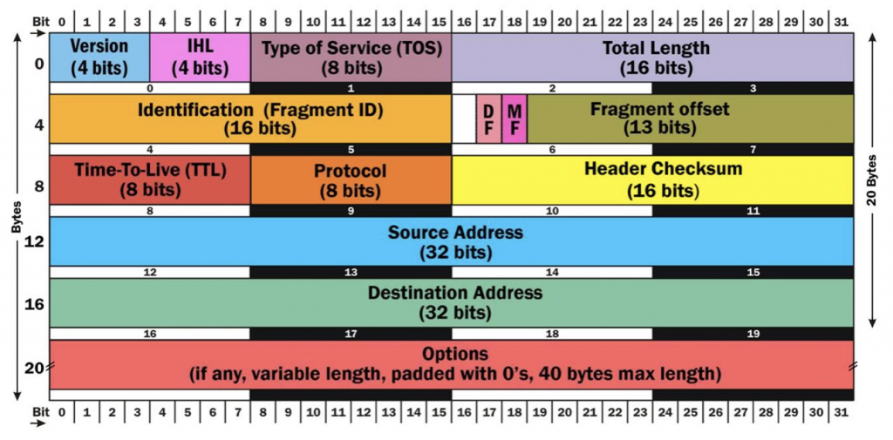

# Setup
#### Install docker with
```
sudo apt-get update

sudo apt-get install ca-certificates curl gnupg lsb-release

curl -fsSL https://download.docker.com/linux/ubuntu/gpg | sudo gpg --dearmor -o /usr/share/keyrings/docker-archive-keyring.gpg

echo \
  "deb [arch=$(dpkg --print-architecture) signed-by=/usr/share/keyrings/docker-archive-keyring.gpg] https://download.docker.com/linux/ubuntu \
  $(lsb_release -cs) stable" | sudo tee /etc/apt/sources.list.d/docker.list > /dev/null

sudo apt-get update

sudo apt-get install docker-ce docker-ce-cli containerd.io -y
```

#### Run a nginx container with
`sudo docker run -d -p 80:80 --hostname inside-docker --name nginx nginx`

#### Open shell inside that docker container with 
`sudo docker exec -it nginx bash`

#### Install TCPDUMP inside the container
`apt-get update`
`apt-get upgrade -y`
`apt-get install tcpdump -y`

#### *We will communicate from the host to this container to test out our commands.


## 1. Draw the IP Header with detailed bits.



## 2. What is TCPDUMP?

Solution: TCPDUMP is a tool for analyzing network.

## 3. How to get the HTTPS traffic? 

## 4. For everything on an interface, what is the command?
`tcpdump -i eth0`


## 5. Write the command to find traffic by IP.

## 6. Share the filtering by source and destination?

## 7. How to find packets by network?

## 8. How to see packet contents with hex output?

## 9. How to find a specific port traffic, write the command

## 10. Show traffic of one protocol command.

## 11. Write the command showing only IP6 traffic.

## 12. Write the command for finding traffic using port range.

## 13. What are PCAP (PEE-cap) files?

## 14. How are PCAP files processed and why is it so?

## 15. Which switch is used to write the PCAP file called capture_file?

## 16. What is the command for reading/writing capture to a file?

## 17. Which switch is needed to read the PCAP files?

## 18. What is the tcpdump command while reading in a file?

## 19. Which switch is used for the ethernet header?

## 20. What is line-readable output? How is it notified?

## 21. What does `-q` imply?

## 22. What does the tweak `-t` work?

## 23. What does `-tttt` show?

## 24. To listen on the eth0 interface which one is used?

## 25. Purpose for `-vv`?

## 26. Purpose for `-c`?

## 27. Why `-s` is used?

## 28. What does -S, -e, -q, -E imply?

## 29. How to show the raw output view?

## 30. If a specific IP and destined course are given then which tweak is used?

## 31. To pass from one network to anotehr, write the command?

## 32. If a non ICMP traffic goes to a specific IP, what should be the query?

## 33. If a host isn't on a specific port, what will be tweaked and commanded?

## 34. Why single quotes are used?

## 35. How to isolate TCP RST flags?

## 36. To isolate TCP SYN flags, which query is used?

## 37. To isolate packets that have both the SYN and ACK flags set, what should be the command?

## 38. How to isolate TCP URG flags?

## 39. How to isolate TCP ACK flags?

## 40. How to isolate TCP PSH flags?

## 41. How to isolate TCP FIN flags?

## 42. How is GREP used with TCPDUMP?

## 43. Command for both SYN and RST flags?

## 44. What to do for cleartext GET requests?

## 45. What to do to find HTTP host headers?

## 46. How to find HTTP cookies?

## 47. The command line for find SSH connections?

## 48. How to find DNS traffic?

## 49. Command for finding FTP traffic?

## 50. Find NTP traffic, what is the command?

## 51. Command to find cleartext passwords?

## 52. Describe EVIL bit.

## 53. Write the fun filter to find packets where it's been toggled?